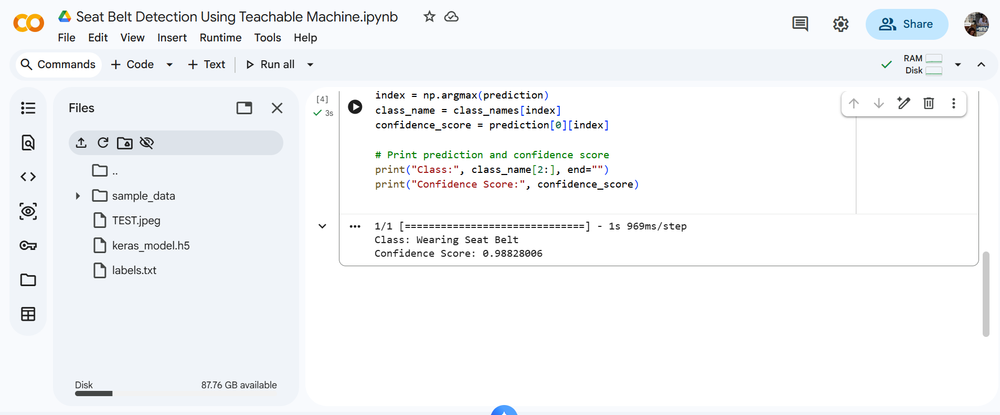

# Seat Belt Detection Using Teachable Machine

## Project Overview

This project is an AI-based image classification system developed using **Google Teachable Machine** and **TensorFlow/Keras**.

The model classifies images into two categories:

- ✅ Wearing Seat Belt
- ❌ Not Wearing Seat Belt

The system predicts whether a person is wearing a seat belt and displays the prediction along with the confidence score.

---

## Project Files

```
Seat-Belt-Detection-Using-Teachable-Machine/
│
├── Seat_Belt_Detection_Using_Teachable_Machine.ipynb
├── keras_model.h5
├── labels.txt
├── TEST.jpeg
├── Screenshot.png
└── README.md
```

---

## Technologies Used

- Google Teachable Machine
- TensorFlow / Keras
- Python
- NumPy
- Pillow (PIL)

---

## Requirements

Install the required libraries before running the project:

```bash
pip install tensorflow==2.12.1
pip install numpy
pip install pillow
pip install opencv-python
```

---

## How to Run

### 1. Download the Project

Download or clone this repository.

### 2. Verify the Files

Make sure the following files are located in the same folder:

- `Seat_Belt_Detection_Using_Teachable_Machine.ipynb`
- `keras_model.h5`
- `labels.txt`
- `TEST.jpeg`

### 3. Open the Notebook

Open the notebook using:

- Google Colab
or
- Jupyter Notebook

### 4. Update the Image Path (if needed)

If you want to test another image, change the following line:

```python
image = Image.open("TEST.jpeg").convert("RGB")
```

Replace **TEST.jpeg** with the name of your image.

### 5. Run the Notebook

Run all cells in the notebook.

The model will predict the image class and display the confidence score.

---

## Model Classes

| Class | Description |
|--------|-------------|
| Wearing Seat Belt | The person is wearing a seat belt. |
| Not Wearing Seat Belt | The person is not wearing a seat belt. |

---

## Example Output

```
Prediction: Wearing Seat Belt
Confidence Score: 98.54%
```

---

## Project Objective

The objective of this project is to demonstrate how image classification can be implemented using **Google Teachable Machine**. The trained model identifies whether a person is wearing a seat belt, providing a simple example of applying artificial intelligence to support road safety awareness.

---

## Screenshots

### 1. Model Training using Google Teachable Machine

After uploading the training images for both classes, the model was trained using Google Teachable Machine.

> Add your training screenshot here.

Example:


---

### 2. Prediction Result

The trained model was tested using a sample image (`TEST.jpeg`). The prediction and confidence score are shown below.



---

## Project Workflow

1. Collect images for two classes:
   - Wearing Seat Belt
   - Not Wearing Seat Belt
2. Train the model using Google Teachable Machine.
3. Export the model in TensorFlow/Keras format.
4. Open the notebook in Google Colab or Jupyter Notebook.
5. Load the exported model and labels.
6. Test the model using an input image.
7. Display the predicted class and confidence score.

---

## Author

Computer Science Student  
Developed as part of the Artificial Intelligence Training Track.

---
